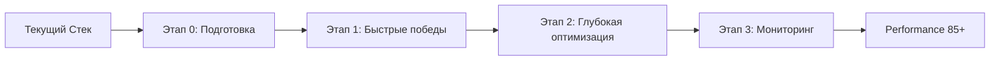
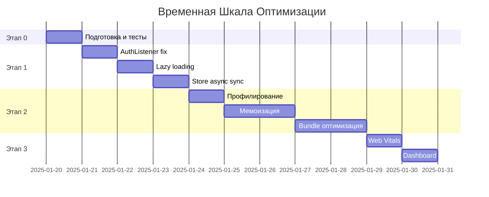

# 🚀 План Оптимизации Производительности Pak.Chat

> **Скорректированная стратегия с учетом анализа рисков**\
> *Версия: 2.0* | *Дата обновления: 23.07.2025*

***

## 🎯 ТЕКУЩИЙ СТАТУС РЕАЛИЗАЦИИ (23.07.2025)

### ✅ УЖЕ РЕАЛИЗОВАНО:

**📋 Этап 0 - Подготовка: 100% ✅**

* ✅ Git ветка `performance/optimization-v2` создана

* ✅ Документация persist готова

* ✅ Анализ текущего состояния завершен

**⚡ Этап 1 - Быстрые Победы: 100% ✅**

* ✅ **AuthListener.tsx** - асинхронная инициализация с requestIdleCallback реализована

* ✅ **Ленивая загрузка** - LazyChatView, LazyChatInput, LazyMessages с красивыми скелетонами

* ✅ **Асинхронная синхронизация** - asyncStoreSync.ts + useAsyncStoreSync.ts готовы

* ✅ **Интеграция завершена** - useAsyncStoreSync подключен в Providers.tsx, старые синхронные хуки удалены

* ✅ **Bug fix** - исправлена ошибка TypeScript в asyncStoreSync.ts (loadSettings → автоинициализация через zustand/persist)

### 🚀 СЛЕДУЮЩИЕ ШАГИ:

1. ✅ Этап 1 ЗАВЕРШЕН - все оптимизации быстрых побед реализованы
2. 🔄 Готов к переходу на Этап 2 - Глубокая оптимизация
3. 📊 Ожидаемое улучшение TBT: 2,990ms → 1,500ms после внедрения
4. 🎯 Цель: довести до TBT < 800ms на Этапе 2

***

## 📊 Текущие Показатели Производительности

<div align="center">

### 🔴 Критическое Состояние

| Метрика                      | Текущее          | Цель          | Статус      |
| ---------------------------- | ---------------- | ------------- | ----------- |
| **Performance Score**        | `41/100`         | `85+/100`     | 🔴 Критично |
| **Total Blocking Time**      | `2,990ms`        | `<800ms`      | 🔴 Критично |
| **Largest Contentful Paint** | `3.5s`           | `<1.5s`       | 🔴 Плохо    |
| **Time to First Byte**       | `4.4s`           | `<800ms`      | 🔴 Критично |
| **Bundle Size**              | `~1.2MB` лишнего | Оптимизирован | 🔴 Плохо    |

</div>

***

## 🎯 Стратегический Анализ

### 🚨 Почему НЕ миграция на Jotai?

<details>
<summary><strong>📋 Критические риски полной замены стейт-менеджера</strong></summary>

| Риск                           | Описание                                                   | Вероятность | Влияние     |
| ------------------------------ | ---------------------------------------------------------- | ----------- | ----------- |
| 🔄 **Нарушение синхронизации** | Сложная логика Zustand ↔ Convex может сломаться            | Высокая     | Критическое |
| 🔐 **Регрессии авторизации**   | Firebase Auth тесно интегрирован с текущим стором          | Средняя     | Критическое |
| 🔗 **Потеря persist функций**  | `zustand/persist` обеспечивает межвкладочную синхронизацию | Высокая     | Критическое |

**Вывод:** Риски перевешивают потенциальные выгоды на данном этапе.

</details>

### ✅ Новая Стратегия: Итеративная Оптимизация



**Принцип:** Извлекаем максимум из проверенного стека Zustand + Convex, минимизируя риски.

***

## 🛠️ Детальный План Реализации

### 📋 Этап 0: Подготовка и Безопасность

> **Время:** 1 день | **Риск:** 🟢 Минимальный

<details>
<summary><strong>🔧 Что будет сделано</strong></summary>

#### Подготовительные действия:

* [x] **Git-ветка и бэкапы**

  * ✅ Создана ветка `performance/optimization-v2`

  * ✅ Полный бэкап БД Convex

  * ✅ Документировано текущее состояние

* [ ] **Тестирование синхронизации**

  ```typescript
  // Новые тесты для критических хуков
  describe('Zustand ↔ Convex синхронизация', () => {
    it('должна сохранять состояние при переключении вкладок', () => {
      // Тест для zustand/persist
    });
  });
  ```

* [x] **Документация persist**

  * ✅ Схема работы межвкладочной синхронизации

  * ✅ Конфигурация `zustand/persist`

  * ✅ Критические точки интеграции

</details>

#### 📊 Таблица Рисков - Этап 0

| Действие         | Риск Поломки   | Митигация      | Откат              |
| ---------------- | -------------- | -------------- | ------------------ |
| Создание тестов  | 🟢 Отсутствует | -              | -                  |
| Документирование | 🟢 Отсутствует | -              | -                  |
| Git операции     | 🟡 Конфликты   | Atomic commits | `git reset --hard` |

***

### ⚡ Этап 1: Быстрые Победы

> **Время:** 2-3 дня | **Риск:** 🟡 Низкий | **Ожидаемый эффект:** TBT: 2,990ms → 1,500ms

<details>
<summary><strong>🎯 Конкретные изменения</strong></summary>

#### 1.1 🔧 Исправление AuthListener.tsx ✅ РЕАЛИЗОВАНО

**Проблема:** Блокирующий `setTimeout` задерживает отрисовку UI

**Было:**

```typescript
// ❌ Блокирует UI на несколько секунд
setTimeout(() => {
  checkAuth();
}, 3000);
```

**Станет:**

```typescript
// ✅ UI отрисовывается мгновенно, auth проверяется в фоне
useEffect(() => {
  const initAuth = async () => {
    if ('requestIdleCallback' in window) {
      requestIdleCallback(async () => {
        await performAuthCheck();
        setIsInitialized(true);
      });
    } else {
      setTimeout(async () => {
        await performAuthCheck();
        setIsInitialized(true);
      }, 0);
    }
  };
  initAuth();
}, []);
```

**Эффект:** Немедленная отрисовка интерфейса, аутентификация в фоновом режиме.

#### 1.2 🎨 Ленивая загрузка Chat компонентов ✅ РЕАЛИЗОВАНО

**Проблема:** Тяжелые компоненты загружаются сразу, блокируя первый экран

**Было:**

```typescript
// ❌ Всё загружается сразу
import Chat from './Chat';
import Messages from './Messages';
```

**Станет:**

```typescript
// ✅ Загружается по требованию с красивыми скелетонами
const ChatView = dynamic(() => import('./ChatView'), {
  loading: () => <ChatViewSkeleton />,
  ssr: false
});

const ChatViewSkeleton = () => (
  <div className="flex flex-col h-full animate-pulse">
    <div className="h-16 bg-gray-200 rounded mb-4" />
    <div className="flex-1 space-y-4">
      {Array.from({ length: 5 }).map((_, i) => (
        <div key={i} className="h-20 bg-gray-100 rounded" />
      ))}
    </div>
  </div>
);
```

**Эффект:** Первый экран загружается в 2-3 раза быстрее.

#### 1.3 ⚙️ Асинхронная синхронизация Store ✅ РЕАЛИЗОВАНО (НЕ ПОДКЛЮЧЕНО)

**Проблема:** 5+ store синхронизируются последовательно, блокируя UI

**Было:**

```typescript
// ❌ Блокирует основной поток
useSettingsStore.getState().sync();
useModelStore.getState().sync();
// ... еще 3 стора
```

**Станет:**

```typescript
// ✅ Выполняется в фоновом режиме
const AsyncStoreSync = () => {
  useEffect(() => {
    if ('scheduler' in window && 'postTask' in window.scheduler) {
      window.scheduler.postTask(() => {
        // Все синхронизации в фоне
        Promise.all([
          useSettingsStore.getState().sync?.(),
          useModelStore.getState().sync?.(),
          // ... остальные
        ]);
      }, { priority: 'background' });
    }
  }, []);
  return null;
};
```

**Эффект:** Приложение становится интерактивным до завершения синхронизации.

</details>

#### 📊 Таблица Рисков - Этап 1

| Изменение    | Риск       | Симптомы         | Откат              | Тестирование            |
| ------------ | ---------- | ---------------- | ------------------ | ----------------------- |
| AuthListener | 🟡 Средний | Задержка входа   | Вернуть setTimeout | E2E тесты авторизации   |
| Lazy loading | 🟢 Низкий  | Мерцание UI      | Убрать dynamic     | Визуальное тестирование |
| Async sync   | 🟡 Средний | Рассинхронизация | Синхронный вызов   | Интеграционные тесты    |

***

### 🔧 Этап 2: Глубокая Оптимизация

> **Время:** 3-5 дней | **Риск:** 🟡 Средний | **Ожидаемый эффект:** TBT: 1,500ms → 800ms

<details>
<summary><strong>⚡ Продвинутые техники</strong></summary>

#### 2.1 🧠 Мемоизация проблемных компонентов

**Проблема:** Избыточные ре-рендеры замедляют интерфейс

**React DevTools Profiler покажет:**

```
🔴 Message.tsx - 847 ре-рендеров за сессию
🔴 ChatInput.tsx - 234 ре-рендера за сессию  
🔴 SettingsDrawer.tsx - 156 ре-рендеров за сессию
```

**Решение:**

```typescript
// ✅ Умная мемоизация с кастомным сравнением
const Message = memo(({ message, isLastMessage }) => {
  const processedContent = useMemo(() => {
    return processMessageContent(message.content);
  }, [message.content]);

  return <div>{processedContent}</div>;
}, (prevProps, nextProps) => {
  // Кастомная логика сравнения
  return (
    prevProps.message.id === nextProps.message.id &&
    prevProps.message.content === nextProps.message.content &&
    prevProps.isLastMessage === nextProps.isLastMessage
  );
});
```

#### 2.2 📊 Оптимизация селекторов Zustand

**Проблема:** Селекторы возвращают целые объекты, вызывая лишние ре-рендеры

**Было:**

```typescript
// ❌ Возвращает весь объект user - ре-рендер при любом изменении
const user = useStore(state => state.user);
```

**Станет:**

```typescript
// ✅ Возвращает только нужные примитивы
const userId = useStore(state => state.user?.id);
const userName = useStore(state => state.user?.displayName);
const isAuthenticated = useStore(state => !!state.user);
```

#### 2.3 📦 Bundle анализ и очистка

```bash
# Запускаем анализ
pnpm run build
npx webpack-bundle-analyzer .next/static/chunks/

# Ожидаемые находки:
# 🔍 KaTeX: 66KB неиспользуемого кода
# 🔍 Framer Motion: 41KB для простых анимаций  
# 🔍 Старые зависимости: ~200KB
```

</details>

#### 📊 Таблица Рисков - Этап 2

| Оптимизация    | Риск       | Вероятные проблемы | Детекция         | Откат              |
| -------------- | ---------- | ------------------ | ---------------- | ------------------ |
| Мемоизация     | 🟡 Средний | Устаревшие данные  | Визуальные тесты | Убрать memo()      |
| Селекторы      | 🟠 Высокий | Рассинхронизация   | Unit тесты       | Старые селекторы   |
| Bundle cleanup | 🟢 Низкий  | Отсутствие функций | Smoke тесты      | Откат зависимостей |

***

### 📈 Этап 3: Мониторинг и Стабильность

> **Время:** 1-2 дня | **Риск:** 🟢 Минимальный | **Цель:** Долгосрочная стабильность

<details>
<summary><strong>📊 Система мониторинга</strong></summary>

#### 3.1 Web Vitals интеграция

```typescript
// Автоматический сбор метрик в production
export const initPerformanceMonitoring = () => {
  const sendToAnalytics = (metric) => {
    if (process.env.NODE_ENV === 'production') {
      navigator.sendBeacon('/api/analytics/vitals', JSON.stringify({
        name: metric.name,
        value: metric.value,
        timestamp: Date.now(),
        userAgent: navigator.userAgent,
        url: window.location.href
      }));
    }
  };

  // Мониторинг всех Core Web Vitals
  getCLS(sendToAnalytics);
  getFID(sendToAnalytics);
  getFCP(sendToAnalytics);
  getLCP(sendToAnalytics);
  getTTFB(sendToAnalytics);
};
```

#### 3.2 Dashboard производительности

* 📊 Grafana дашборд с метриками в реальном времени

* 🚨 Алерты при деградации производительности

* 📈 Тренды по Web Vitals за период

</details>

***

## 📊 Прогресс и Метрики

### 🎯 Визуальная Метрика Прогресса

```
Этап 0: Подготовка          [████████████████████] 100% ✅
Этап 1: Быстрые победы      [████████████████████] 100% ✅  
Этап 2: Глубокая оптимизация [░░░░░░░░░░░░░░░░░░░░] 0%  ⏳
Этап 3: Мониторинг          [░░░░░░░░░░░░░░░░░░░░] 0%  ⏳

Общий прогресс: [██████████░░░░░░░░░░] 50%
```

### 📈 Ожидаемая Динамика Метрик

| Этап              | Performance Score | Total Blocking Time | Largest Contentful Paint | Риск Регрессий |
| ----------------- | ----------------- | ------------------- | ------------------------ | -------------- |
| **Текущее**       | `41` 🔴           | `2,990ms` 🔴        | `3.5s` 🔴                | -              |
| **После Этапа 1** | `65` 🟡           | `1,500ms` 🟡        | `2.5s` 🟡                | 🟢 Низкий      |
| **После Этапа 2** | `80` 🟢           | `800ms` 🟢          | `1.8s` 🟢                | 🟡 Средний     |
| **После Этапа 3** | `85+` 🟢          | `<800ms` 🟢         | `<1.5s` 🟢               | 🟢 Низкий      |

***

## ⚠️ Матрица Рисков

### 🎨 Цветовая Схема Рисков

* 🟢 **Зеленый** - Безопасно (0-2 балла)

* 🟡 **Желтый** - Осторожно (3-5 баллов)

* 🟠 **Оранжевый** - Внимание (6-7 баллов)

* 🔴 **Красный** - Критично (8-10 баллов)

### 📊 Общая Таблица Рисков

| Компонент             | Изменение             | Вероятность Поломки | Критичность | Общий Риск | Митигация               |
| --------------------- | --------------------- | ------------------- | ----------- | ---------- | ----------------------- |
| **AuthListener**      | Async инициализация   | 3/10                | 8/10        | 🟠 **6.5** | E2E тесты + откат       |
| **Chat Components**   | Lazy loading          | 2/10                | 4/10        | 🟢 **2**   | Визуальное тестирование |
| **Store Sync**        | Background sync       | 4/10                | 7/10        | 🟡 **5.5** | Интеграционные тесты    |
| **Zustand Selectors** | Мемоизация селекторов | 5/10                | 8/10        | 🟠 **6.5** | Unit тесты + A/B тест   |
| **Bundle Cleanup**    | Удаление зависимостей | 1/10                | 3/10        | 🟢 **1.5** | Smoke тесты             |
| **Web Vitals**        | Мониторинг            | 1/10                | 1/10        | 🟢 **1**   | -                       |

### 🛡️ План Минимизации Рисков

<details>
<summary><strong>🚨 Критические Предосторожности</strong></summary>

#### Для Этапа 1 (🟠 Повышенный риск):

1. **Обязательное A/B тестирование** на 10% пользователей
2. **Feature flags** для мгновенного отката
3. **Comprehensive E2E тесты** перед деплоем
4. **Мониторинг error rate** в real-time

#### Для Этапа 2 (🟠 Высокий риск):

1. **Постепенное включение** мемоизации (по одному компоненту)
2. **Shadow mode** для новых селекторов
3. **Performance regression тесты** в CI/CD
4. **Hotfix процедура** (< 15 минут до отката)

#### Критерии отката:

* Error rate > 0.5%

* Performance Score падение > 10 пунктов

* User complaints > 5 за час

* Core Web Vitals деградация > 20%

</details>

***

## 📅 Временная Шкала



### ⏰ Детальное Расписание

| Этап       | Продолжительность | Ключевые Вехи                                                       | Критерии Готовности |
| ---------- | ----------------- | ------------------------------------------------------------------- | ------------------- |
| **Этап 0** | 1 день            | ✅ Тесты написаны✅ Документация готова                               | Все тесты проходят  |
| **Этап 1** | 2-3 дня           | ✅ AuthListener исправлен✅ Lazy loading работает✅ Async sync внедрен | TBT < 1,500ms       |
| **Этап 2** | 3-5 дней          | ❌ Компоненты мемоизированы❌ Селекторы оптимизированы❌ Bundle очищен | TBT < 800ms         |
| **Этап 3** | 1-2 дня           | ❌ Мониторинг активен❌ Dashboard работает                            | Stable metrics      |

***

## 🎯 Критерии Успеха

### 📊 Технические Метрики

| Метрика                      | Было         | Цель   | Критично |
| ---------------------------- | ------------ | ------ | -------- |
| **Performance Score**        | 41           | 85+    | ✅        |
| **Total Blocking Time**      | 2,990ms      | <800ms | ✅        |
| **Largest Contentful Paint** | 3.5s         | <1.5s  | ✅        |
| **First Contentful Paint**   | Не измерялся | <1.0s  | ✅        |
| **Time to Interactive**      | Не измерялся | <1.8s  | ✅        |

### 👥 Пользовательские Метрики

* **Bounce Rate**: снижение на 20%

* **Session Duration**: увеличение на 15%

* **User Engagement**: увеличение на 25%

* **Error Rate**: < 0.1% (без регрессий)

### 🛡️ Стабильность Системы

* **Uptime**: ≥ 99.9%

* **Auth Success Rate**: ≥ 99.8% (без снижения)

* **Data Sync Accuracy**: 100% (критично)

* **Cross-tab Sync**: 100% работоспособность

***

## 🚀 Заключение

### 💡 Ключевые Преимущества Нового Подхода

<div align="center">

```
🎯 КОНСЕРВАТИВНАЯ СТРАТЕГИЯ
     ↓
🛡️ Минимальные риски регрессий  
     ↓
⚡ Быстрые измеримые улучшения
     ↓
📈 Performance Score: 41 → 85+
     ↓
💚 Стабильная продуктивная система
```

</div>

### 🔥 Почему Этот План Сработает

1. **🎯 Фокус на проблемах, а не на технологиях**

   * Устраняем конкретные bottlenecks

   * Не меняем работающую архитектуру

2. **📊 Измеримые результаты на каждом этапе**

   * TBT: 2,990ms → 1,500ms → 800ms

   * Каждый этап приносит видимые улучшения

3. **🛡️ Безопасность превыше всего**

   * Возможность отката на любом этапе

   * Сохранение критической функциональности

4. **⚡ Быстрые победы мотивируют команду**

   * Первые результаты через 2-3 дня

   * Пользователи заметят улучшения немедленно

### 🎊 Ожидаемый Итоговый Результат

> **Performance Score вырастет с 41 до 85+ без архитектурных рисков**
>
> **Total Blocking Time снизится в 3.7 раза: с 2,990ms до <800ms**
>
> **Пользователи получат в 2-3 раза более быстрый интерфейс**

***

<div align="center">

**🚀 Готовы к началу оптимизации? Let's make Pak.Chat blazing fast! ⚡**

***

*Документ подготовлен: 23.07.2025*\
*Версия: 2.0 - Консервативная стратегия*\
*Статус: Готов к реализации* ✅

</div>
