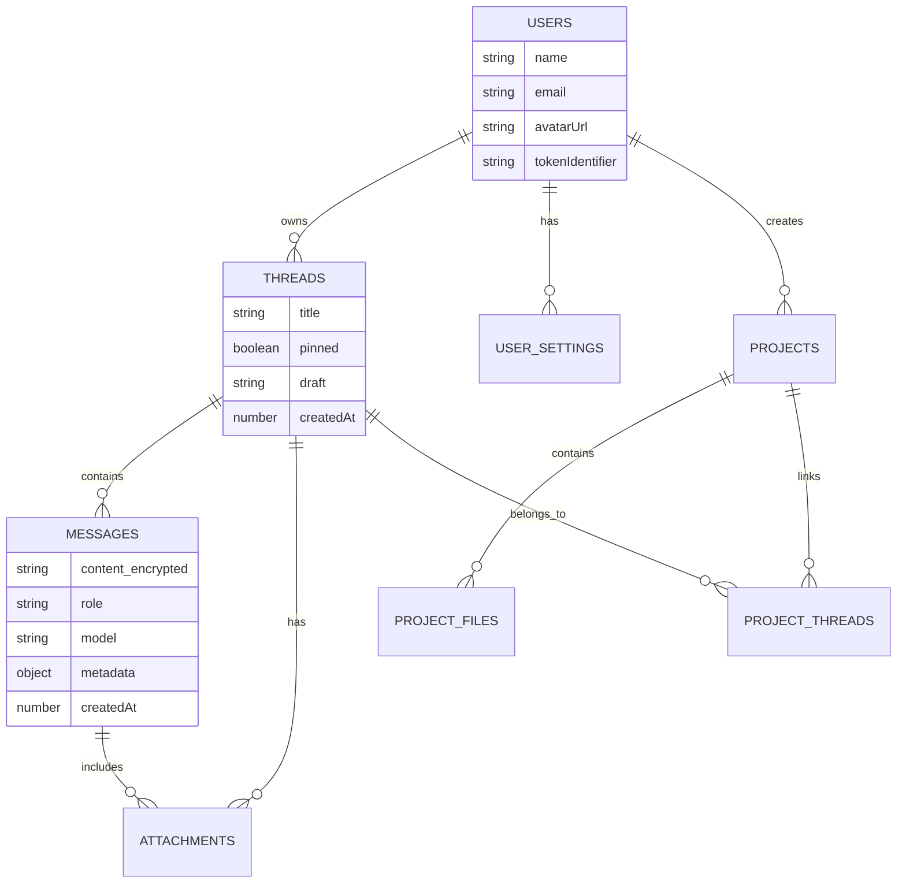

# Backend Architecture

## Overview

Pak.Chat's backend is built on Convex, a real-time database platform that provides a serverless backend with automatic synchronization, TypeScript support, and built-in file storage. The architecture emphasizes security, real-time updates, and data consistency.

## Convex Backend Structure

```
D:\Desktop\Projects\Pak.Chat\convex\
├── _generated/               # Auto-generated Convex types and API
├── schema.ts                 # Database schema definition
├── auth.config.js           # Firebase authentication configuration
├── encryption.ts            # Message encryption/decryption utilities
├── users.ts                 # User management and synchronization
├── messages.ts              # Message CRUD operations
├── threads.ts               # Chat thread management
├── attachments.ts           # File storage and retrieval
├── userSettings.ts          # User preferences persistence
├── apiKeys.ts               # Encrypted API key storage
├── customModes.ts           # Custom AI mode management
├── projects.ts              # Project organization
├── projectFiles.ts          # Project file management
├── projectThreads.ts        # Project-thread associations
└── utils.ts                 # Shared utility functions
```

## Database Schema Architecture

### Schema Definition (`D:\Desktop\Projects\Pak.Chat\convex\schema.ts`)

The database uses 12 main tables with optimized indexes for performance:

#### 1. Users Table (`line 7-12`)
```typescript
users: defineTable({
  name: v.string(),
  email: v.optional(v.string()),
  avatarUrl: v.optional(v.string()),
  tokenIdentifier: v.string(),
}).index("by_token", ["tokenIdentifier"])
```

**Purpose**: User profile storage synchronized with Firebase Auth
**Key Features**:
- Firebase token integration
- Profile information caching
- Unique token identifier indexing

#### 2. Messages Table (`line 79-88`)
```typescript
messages: defineTable({
  threadId: v.id("threads"),
  authorId: v.id("users"),
  role: v.union(v.literal("user"), v.literal("assistant")),
  content: v.string(),              // Encrypted content
  createdAt: v.number(),
  model: v.optional(v.string()),
  metadata: v.optional(v.any()),    // For image generation data, etc.
}).index("by_thread_and_time", ["threadId", "createdAt"])
```

**Security Features**:
- All content is encrypted before storage
- Thread-scoped access control
- Metadata for rich message types (images, attachments)

#### 3. Threads Table (`line 64-76`)
```typescript
threads: defineTable({
  userId: v.id("users"),
  title: v.string(),
  system: v.optional(v.boolean()),
  createdAt: v.number(),
  pinned: v.optional(v.boolean()),
  clonedFrom: v.optional(v.id("threads")),
  forkedFromMessageId: v.optional(v.id("messages")),
  draft: v.optional(v.string()),    // Auto-saved drafts
})
.index("by_user_and_time", ["userId", "createdAt"])
.searchIndex("by_title", { searchField: "title" })
```

**Advanced Features**:
- Thread forking and cloning
- Full-text search on titles
- Draft message persistence

#### 4. User Settings Table (`line 15-43`)
```typescript
userSettings: defineTable({
  userId: v.id("users"),
  encryptedApiKeys: v.string(),
  uiFont: v.optional(v.string()),
  codeFont: v.optional(v.string()),
  hidePersonal: v.optional(v.boolean()),
  showNavBars: v.optional(v.boolean()),
  showChatPreview: v.optional(v.boolean()),
  // Feature toggles
  isCustomModesEnabled: v.optional(v.boolean()),
  selectedMode: v.optional(v.string()),
  webSearchEnabled: v.optional(v.boolean()),
  selectedModel: v.optional(v.string()),
  // Custom instructions for AI behavior
  customInstructionsName: v.optional(v.string()),
  customInstructionsOccupation: v.optional(v.string()),
  customInstructionsTraits: v.optional(v.array(v.string())),
  customInstructionsTraitsText: v.optional(v.string()),
  customInstructionsAdditionalInfo: v.optional(v.string()),
  // Image generation settings
  imageGenerationModel: v.optional(v.string()),
  imageGenerationSize: v.optional(v.string()),
  imageGenerationQuality: v.optional(v.string()),
  imageGenerationCount: v.optional(v.number()),
  imageGenerationFormat: v.optional(v.string()),
  imageGenerationCompression: v.optional(v.number()),
}).index("by_user", ["userId"])
```

### Data Relationships



## Authentication & Authorization

### Firebase Integration (`D:\Desktop\Projects\Pak.Chat\convex\auth.config.js`)

```javascript
export default {
  providers: [
    {
      domain: `https://securetoken.google.com/pak-chat-75beb`,
      applicationID: "pak-chat-75beb", 
    },
  ]
};
```

### User Management (`D:\Desktop\Projects\Pak.Chat\convex\users.ts`)

#### User Synchronization (`line 57-92`)
```typescript
export const sync = mutation({
  async handler(ctx) {
    const identity = await ctx.auth.getUserIdentity();
    if (!identity) return null;

    const existingUser = await ctx.db
      .query("users")
      .withIndex("by_token", (q) => q.eq("tokenIdentifier", identity.subject))
      .unique();

    if (existingUser) {
      // Update profile if changed
      if (existingUser.name !== identity.name || 
          existingUser.avatarUrl !== identity.pictureUrl) {
        await ctx.db.patch(existingUser._id, {
          name: identity.name!,
          avatarUrl: identity.pictureUrl,
        });
      }
      return existingUser._id;
    } else {
      // Create new user
      return await ctx.db.insert("users", {
        name: identity.name!,
        email: identity.email,
        avatarUrl: identity.pictureUrl,
        tokenIdentifier: identity.subject,
      });
    }
  },
});
```

### Access Control Pattern

All backend functions implement user-scoped access control:

```typescript
// Example from messages.ts (line 15-23)
const uid = await currentUserId(ctx);
if (uid === null) {
  return [];
}
const thread = await ctx.db.get(args.threadId);
if (!thread || thread.userId !== uid)
  throw new Error("Thread not found or permission denied");
```

## Data Encryption System

### Encryption Implementation (`D:\Desktop\Projects\Pak.Chat\convex\encryption.ts`)

#### AES-GCM Encryption (`line 4-6, 48-74`)
```typescript
const ALGORITHM = 'AES-GCM';
const KEY_LENGTH = 256; // bits
const IV_LENGTH = 12; // bytes for GCM

export async function encrypt(plainText: string): Promise<string> {
  try {
    const key = await getKey();
    const encoder = new TextEncoder();
    const data = encoder.encode(plainText);
    
    // Generate random IV
    const iv = crypto.getRandomValues(new Uint8Array(IV_LENGTH));
    
    const encrypted = await crypto.subtle.encrypt(
      { name: ALGORITHM, iv },
      key,
      data
    );
    
    // Combine IV + encrypted data
    const combined = new Uint8Array(iv.length + encrypted.byteLength);
    combined.set(iv);
    combined.set(new Uint8Array(encrypted), iv.length);
    
    // Return as base64
    return btoa(String.fromCharCode(...combined));
  } catch (error) {
    console.error('Encryption failed:', error);
    return plainText; // Graceful fallback
  }
}
```

#### Key Derivation (`line 9-31`)
```typescript
async function deriveKey(secret: string): Promise<CryptoKey> {
  const encoder = new TextEncoder();
  const keyMaterial = await crypto.subtle.importKey(
    'raw',
    encoder.encode(secret),
    { name: 'PBKDF2' },
    false,
    ['deriveKey']
  );

  return crypto.subtle.deriveKey(
    {
      name: 'PBKDF2',
      salt: encoder.encode('pak-chat-salt'),
      iterations: 100000,
      hash: 'SHA-256',
    },
    keyMaterial,
    { name: ALGORITHM, length: KEY_LENGTH },
    false,
    ['encrypt', 'decrypt']
  );
}
```

#### Graceful Decryption (`line 140-160`)
```typescript
export async function tryDecrypt(value: string): Promise<string> {
  if (!value || value.length === 0) {
    return '';
  }
  
  // Handle legacy plain text data
  if (!isValidBase64(value) || value.length < 20) {
    return value;
  }
  
  try {
    const decrypted = await decrypt(value);
    return decrypted;
  } catch (error) {
    console.warn(`Failed to decrypt, returning as plain text: ${error}`);
    return value; // Graceful degradation
  }
}
```

**Security Features**:
- **AES-256-GCM**: Authenticated encryption
- **PBKDF2**: Key derivation with 100,000 iterations
- **Random IVs**: Each message uses unique initialization vector
- **Graceful Fallback**: Handles legacy unencrypted data

## File Storage System

### Attachment Management (`D:\Desktop\Projects\Pak.Chat\convex\attachments.ts`)

#### Upload URL Generation (`line 5-7`)
```typescript
export const generateUploadUrl = mutation(async (ctx) => {
  return await ctx.storage.generateUploadUrl();
});
```

#### File Storage with Preview (`line 9-50`)
```typescript
export const save = mutation({
  args: {
    threadId: v.id('threads'),
    attachments: v.array(
      v.object({
        storageId: v.string(),
        previewId: v.optional(v.string()),    // Compressed preview
        name: v.string(),
        type: v.string(),
        messageId: v.union(v.string(), v.null(), v.id('messages')),
        width: v.optional(v.number()),
        height: v.optional(v.number()),
        size: v.optional(v.number()),
      })
    ),
  },
  async handler(ctx, args) {
    // Handle both original files and compressed previews
    const saved = await Promise.all(
      args.attachments.map(async (a) => {
        const attachmentId = await ctx.db.insert('attachments', {
          threadId: args.threadId,
          fileId: a.storageId,
          previewId: a.previewId,    // Optional preview for images
          name: a.name,
          type: a.type,
          width: a.width,
          height: a.height,
          size: a.size,
          messageId: messageIdToSave,
        });
      })
    );
  },
});
```

**Storage Features**:
- **Convex Native Storage**: Built-in file storage with CDN
- **Preview Generation**: Automatic compressed previews for images
- **URL Caching**: Temporary URL caching with TTL
- **Type Support**: Images, documents, PDFs, code files

## Message System

### Message Operations (`D:\Desktop\Projects\Pak.Chat\convex\messages.ts`)

#### Message Retrieval with Decryption (`line 9-84`)
```typescript
export const get = query({
  args: {
    threadId: v.id("threads"),
    cursor: v.optional(v.string()),
    limit: v.optional(v.number()),
  },
  async handler(ctx, args) {
    const uid = await currentUserId(ctx);
    if (uid === null) return [];
    
    const thread = await ctx.db.get(args.threadId);
    if (!thread || thread.userId !== uid)
      throw new Error("Thread not found or permission denied");
      
    const msgs = await ctx.db
      .query("messages")
      .withIndex("by_thread_and_time", (q) => q.eq("threadId", args.threadId))
      .order("asc")
      .collect();
    
    // Decrypt message contents and load attachments
    const decrypted = await Promise.all(
      msgs.map(async (m) => {
        const attachments = await ctx.db
          .query("attachments")
          .withIndex("by_message", (q) => q.eq("messageId", m._id))
          .collect();
        
        const attachmentsWithUrls = await Promise.all(
          attachments.map(async (a) => {
            // Handle image previews and original URLs
            let url: string | null = null;
            let originalUrl: string | null = null;
            
            if (a.type.startsWith('image/')) {
              originalUrl = await ctx.storage.getUrl(a.fileId);
              if (a.previewId) {
                url = await ctx.storage.getUrl(a.previewId);
              } else {
                url = originalUrl;
              }
            }
            
            return {
              id: a._id,
              url,
              originalUrl,
              name: a.name,
              type: a.type,
              size: a.size,
              width: a.width,
              height: a.height,
            };
          })
        );
        
        return { 
          ...m, 
          content: await tryDecrypt(m.content),
          attachments: attachmentsWithUrls,
          metadata: m.metadata,
        };
      })
    );
    return decrypted;
  },
});
```

#### Message Sending with Encryption (`line 193-221`)
```typescript
export const send = mutation({
  args: {
    threadId: v.id("threads"),
    role: v.union(v.literal("user"), v.literal("assistant")),
    content: v.string(),
    model: v.optional(v.string()),
    metadata: v.optional(v.any()),
  },
  async handler(ctx, args) {
    const uid = await currentUserId(ctx);
    if (!uid) throw new Error("Unauthenticated");
    if (!args.content.trim()) throw new Error("Empty message");
    
    const thread = await ctx.db.get(args.threadId);
    if (!thread || thread.userId !== uid)
      throw new Error("Thread not found or permission denied");
      
    const id = await ctx.db.insert("messages", {
      threadId: args.threadId,
      authorId: uid,
      role: args.role,
      content: await encrypt(args.content),    // Encrypt before storage
      createdAt: Date.now(),
      model: args.model,
      metadata: args.metadata,
    });
    
    // Clear saved draft after successful send
    await ctx.db.patch(args.threadId, { draft: "" });
    return id as Id<"messages">;
  },
});
```

## Real-time Synchronization

### Query/Mutation Pattern

All data operations follow Convex's query/mutation pattern:

#### Queries (Read-only)
- **Reactive**: Automatically update when underlying data changes
- **Cached**: Results are cached and shared across components
- **Type-safe**: Full TypeScript support with auto-generated types

#### Mutations (Write operations)
- **Atomic**: All operations succeed or fail together
- **Consistent**: Database constraints enforced
- **Optimistic**: Can be combined with optimistic updates

### Subscription Management

```typescript
// Automatic subscriptions through React hooks
const messages = useQuery(api.messages.get, { threadId });
const threads = useQuery(api.threads.list, {});

// Real-time updates trigger component re-renders
useEffect(() => {
  // Component updates when messages change
}, [messages]);
```

## Performance Optimization

### Database Indexing Strategy

#### Primary Indexes
```typescript
// User-scoped data access
.index("by_user", ["userId"])
.index("by_user_and_time", ["userId", "createdAt"])

// Message retrieval
.index("by_thread_and_time", ["threadId", "createdAt"])

// File associations
.index("by_message", ["messageId"])
.index("by_thread", ["threadId"])
```

#### Search Indexes
```typescript
// Full-text search
.searchIndex("by_title", { searchField: "title" })
```

### Query Optimization

#### Efficient Data Loading
```typescript
// Load messages with attachments in single query batch
const msgs = await ctx.db.query("messages")
  .withIndex("by_thread_and_time", (q) => q.eq("threadId", args.threadId))
  .order("asc")
  .collect();

// Batch load all attachments
const attachmentPromises = msgs.map(async (m) => {
  return ctx.db.query("attachments")
    .withIndex("by_message", (q) => q.eq("messageId", m._id))
    .collect();
});
```

#### Conditional Querying
```typescript
// Skip queries when user not authenticated
const messages = useQuery(
  api.messages.get,
  shouldQuery ? { threadId: threadId as Id<'threads'> } : 'skip'
);
```

## Error Handling and Resilience

### Graceful Degradation
- **Encryption Failures**: Fall back to plaintext storage
- **Network Issues**: Automatic retry with exponential backoff
- **Storage Errors**: Graceful error messages to users

### Data Validation
```typescript
// Runtime validation with Convex validators
args: {
  threadId: v.id("threads"),
  content: v.string(),
  model: v.optional(v.string()),
}
```

### Security Boundaries
- **User Isolation**: All queries scoped to authenticated user
- **Input Sanitization**: Automatic XSS protection
- **Rate Limiting**: Built-in DoS protection

## Monitoring and Observability

### Built-in Monitoring
- **Function Performance**: Automatic latency tracking
- **Error Logging**: Centralized error collection
- **Usage Analytics**: Query and mutation metrics

### Custom Logging
```typescript
// Structured logging for debugging
console.error('Encryption failed:', error);
console.warn(`Failed to decrypt, returning as plain text: ${error}`);
```

---

*This document reflects the current backend architecture as implemented in the Pak.Chat Convex backend at D:\Desktop\Projects\Pak.Chat\convex\*