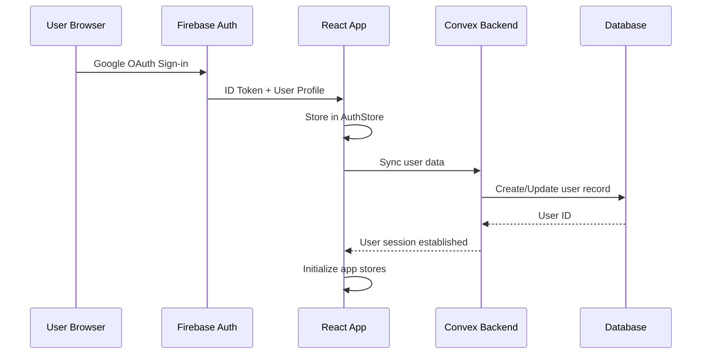
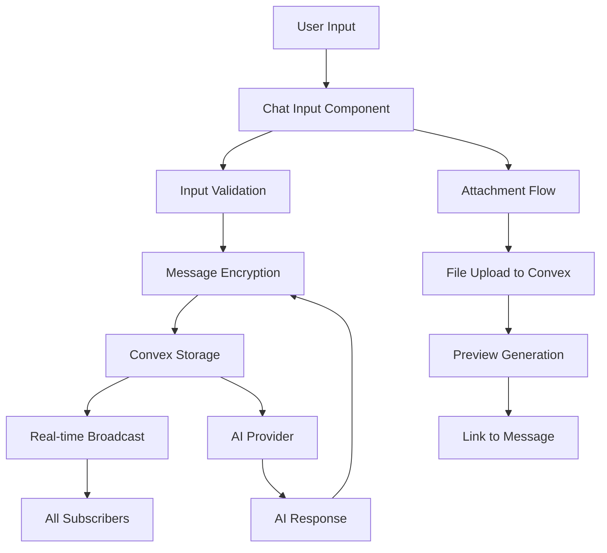
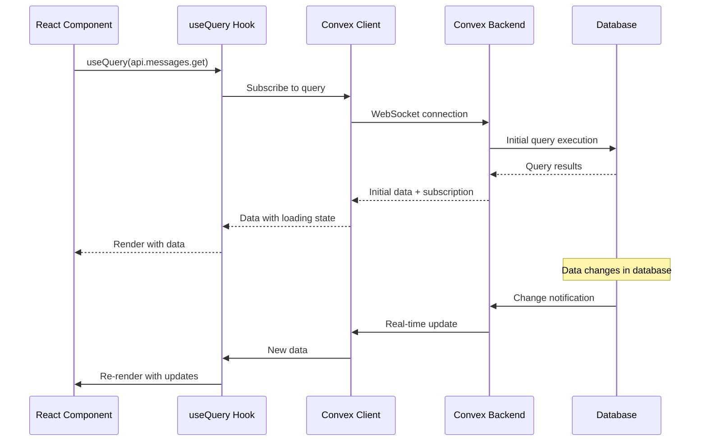
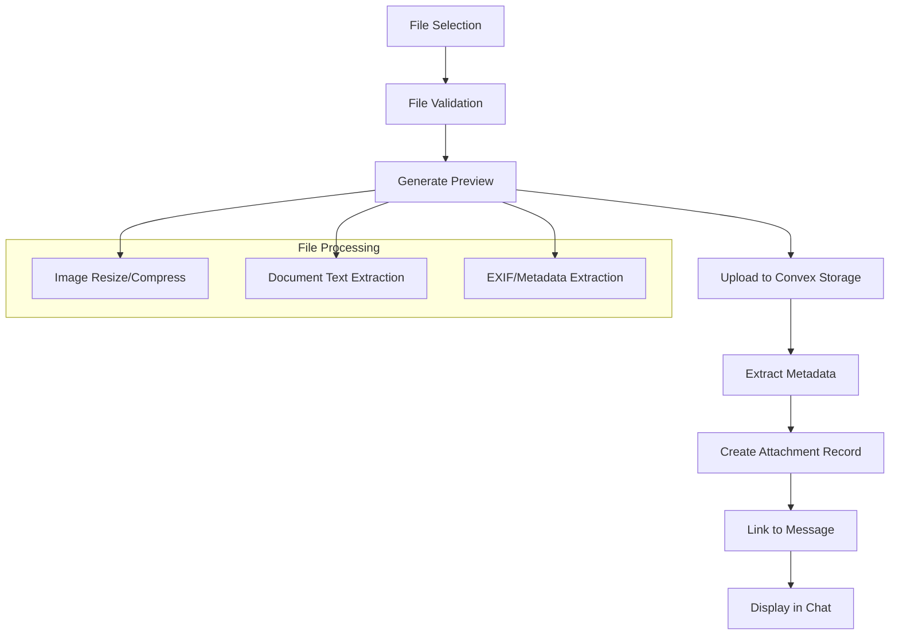
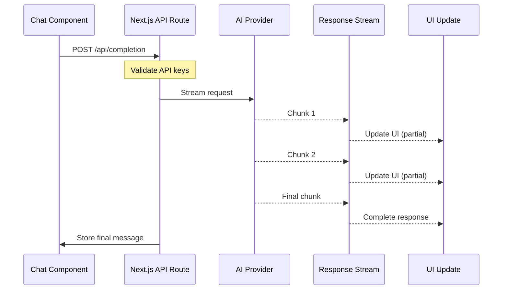
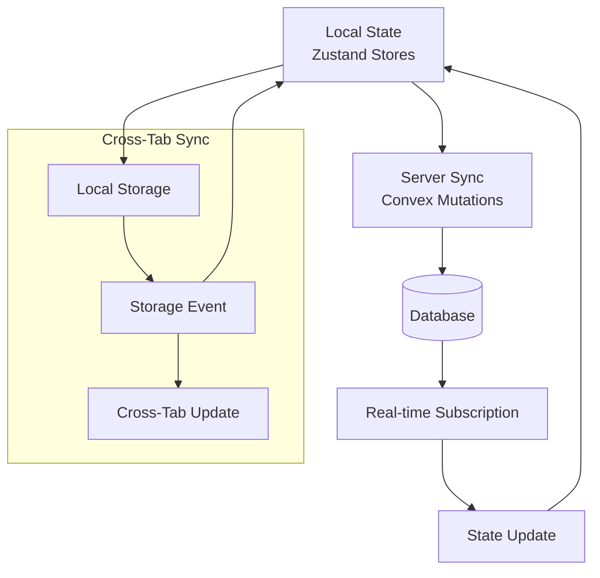
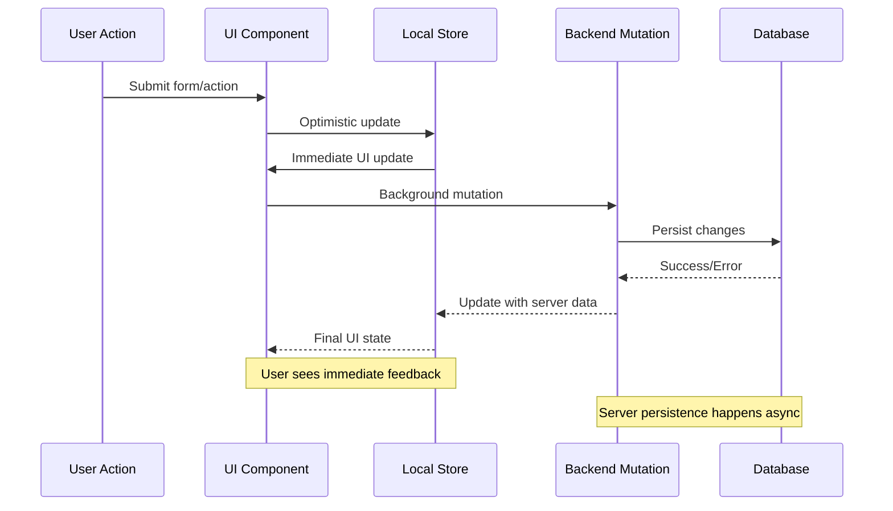
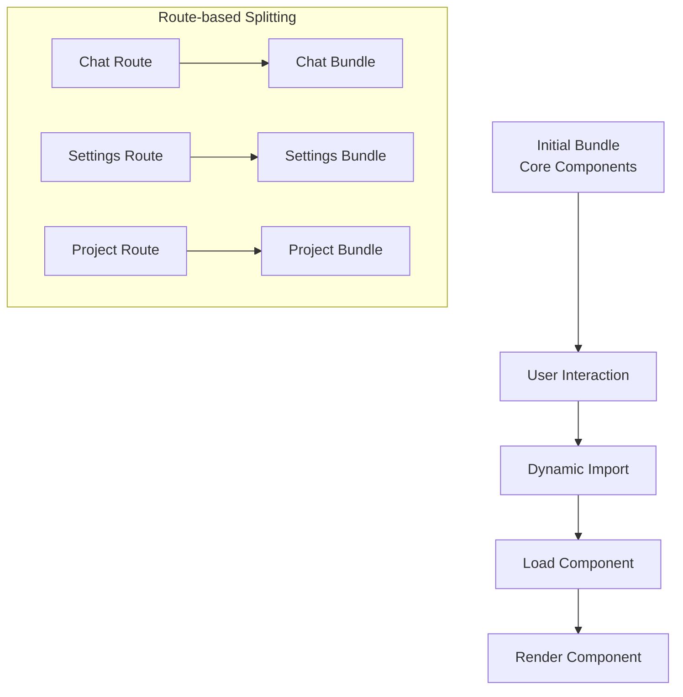
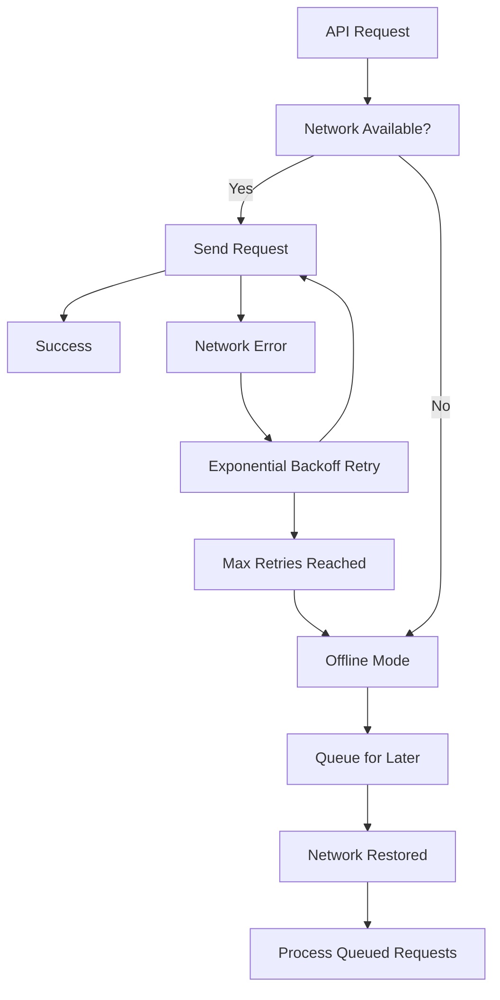

# Data Flow Architecture

## Overview

Pak.Chat implements a sophisticated data flow architecture that ensures real-time synchronization, optimistic updates, and secure data handling across the entire application stack. This document details the complete data flow patterns from user interactions to backend persistence.

## Core Data Flow Patterns

### 1. Authentication Flow



#### Implementation Details

**AuthStore Integration** (`D:\Desktop\Projects\Pak.Chat\src\frontend\stores\AuthStore.ts:67-76`):
```typescript
const init = () => {
  const unsub = onAuthStateChanged(auth, async (user) => {
    set({ user, loading: false });
  });
  return unsub;
};
```

**Convex User Sync** (`D:\Desktop\Projects\Pak.Chat\convex\users.ts:57-92`):
```typescript
export const sync = mutation({
  async handler(ctx) {
    const identity = await ctx.auth.getUserIdentity();
    const existingUser = await ctx.db
      .query("users")
      .withIndex("by_token", (q) => q.eq("tokenIdentifier", identity.subject))
      .unique();
    
    if (existingUser) {
      // Update profile if changed
      if (existingUser.name !== identity.name) {
        await ctx.db.patch(existingUser._id, {
          name: identity.name!,
          avatarUrl: identity.pictureUrl,
        });
      }
    } else {
      // Create new user
      return await ctx.db.insert("users", { /* user data */ });
    }
  },
});
```

### 2. Message Flow Architecture



#### Message Sending Flow

**1. User Input Processing** (`D:\Desktop\Projects\Pak.Chat\src\frontend\components\chat-input\ChatInput.tsx:35-50`):
```typescript
interface ChatInputProps {
  threadId: string;
  thread: Doc<'threads'> | null | undefined;
  input: UseChatHelpers['input'];
  setInput: UseChatHelpers['setInput'];
  append: UseChatHelpers['append'];
  messageCount: number;
  onThreadCreated?: (id: Id<'threads'>) => void;
}
```

**2. Message Encryption** (`D:\Desktop\Projects\Pak.Chat\convex\encryption.ts:48-74`):
```typescript
export async function encrypt(plainText: string): Promise<string> {
  const key = await getKey();
  const data = new TextEncoder().encode(plainText);
  const iv = crypto.getRandomValues(new Uint8Array(IV_LENGTH));
  
  const encrypted = await crypto.subtle.encrypt(
    { name: ALGORITHM, iv },
    key,
    data
  );
  
  // Combine IV + encrypted data and return as base64
  const combined = new Uint8Array(iv.length + encrypted.byteLength);
  combined.set(iv);
  combined.set(new Uint8Array(encrypted), iv.length);
  return btoa(String.fromCharCode(...combined));
}
```

**3. Database Storage** (`D:\Desktop\Projects\Pak.Chat\convex\messages.ts:193-221`):
```typescript
export const send = mutation({
  async handler(ctx, args) {
    const uid = await currentUserId(ctx);
    const thread = await ctx.db.get(args.threadId);
    if (!thread || thread.userId !== uid)
      throw new Error("Permission denied");
      
    const id = await ctx.db.insert("messages", {
      threadId: args.threadId,
      authorId: uid,
      role: args.role,
      content: await encrypt(args.content),  // Encrypt before storage
      createdAt: Date.now(),
      model: args.model,
      metadata: args.metadata,
    });
    
    await ctx.db.patch(args.threadId, { draft: "" });
    return id;
  },
});
```

### 3. Real-time Subscription Flow



#### Implementation Details

**Message Subscription** (`D:\Desktop\Projects\Pak.Chat\src\frontend\hooks\useConvexMessages.ts:7-21`):
```typescript
export function useConvexMessages(threadId: string) {
  const shouldQuery = useMemo(() => 
    isConvexId(threadId), 
    [threadId]
  );

  const messages = useQuery(
    api.messages.get,
    shouldQuery ? { threadId: threadId as Id<'threads'> } : 'skip'
  );

  return useMemo(() => messages || [], [messages]);
}
```

**Optimized Selectors** (`D:\Desktop\Projects\Pak.Chat\src\frontend\hooks\useOptimizedSelectors.ts`):
```typescript
export const useImageGenerationMode = () => 
  useChatStore(useCallback((state) => state.isImageGenerationMode, []));

export const useHasRequiredKeys = () => 
  useAPIKeyStore(useCallback((state) => 
    Object.values(state.keys).some(key => key?.trim()), []));
```

### 4. File Upload and Attachment Flow



#### File Upload Implementation

**Upload URL Generation** (`D:\Desktop\Projects\Pak.Chat\convex\attachments.ts:5-7`):
```typescript
export const generateUploadUrl = mutation(async (ctx) => {
  return await ctx.storage.generateUploadUrl();
});
```

**Attachment Storage** (`D:\Desktop\Projects\Pak.Chat\convex\attachments.ts:9-50`):
```typescript
export const save = mutation({
  args: {
    threadId: v.id('threads'),
    attachments: v.array(
      v.object({
        storageId: v.string(),
        previewId: v.optional(v.string()),
        name: v.string(),
        type: v.string(),
        width: v.optional(v.number()),
        height: v.optional(v.number()),
        size: v.optional(v.number()),
      })
    ),
  },
  async handler(ctx, args) {
    const saved = await Promise.all(
      args.attachments.map(async (a) => {
        const attachmentId = await ctx.db.insert('attachments', {
          threadId: args.threadId,
          fileId: a.storageId,
          previewId: a.previewId,    // Optional compressed preview
          name: a.name,
          type: a.type,
          width: a.width,
          height: a.height,
          size: a.size,
        });
        
        // Generate signed URLs for both original and preview
        let url = null;
        let originalUrl = null;
        
        if (a.type.startsWith('image/')) {
          originalUrl = await ctx.storage.getUrl(a.storageId);
          if (a.previewId) {
            url = await ctx.storage.getUrl(a.previewId);
          } else {
            url = originalUrl;
          }
        }
        
        return { id: attachmentId, url, originalUrl };
      })
    );
    return saved;
  },
});
```

### 5. AI Provider Integration Flow



#### AI Integration Implementation

**Completion API Route** (`D:\Desktop\Projects\Pak.Chat\src\app\api\completion\route.ts`):
```typescript
export async function POST(req: Request) {
  const { messages, model, threadId } = await req.json();
  
  // Validate API keys and model selection
  const apiKey = getApiKeyForModel(model);
  if (!apiKey) {
    return new Response('API key required', { status: 401 });
  }
  
  // Stream response from AI provider
  const result = await streamText({
    model: getModelInstance(model, apiKey),
    messages: messages,
    onFinish: async (completion) => {
      // Store AI response in database
      await storeMessage(threadId, completion.text, model);
    }
  });
  
  return result.toAIStreamResponse();
}
```

### 6. State Synchronization Flow



#### Settings Synchronization

**Bidirectional Sync** (`D:\Desktop\Projects\Pak.Chat\src\frontend\stores\SettingsStore.ts:104-184`):
```typescript
export function useSettingsSync() {
  const settingsDoc = useQuery(api.userSettings.get, convexUser ? {} : 'skip');
  const save = useMutation(api.userSettings.saveSettings);
  const { settings, setSettings } = useSettingsStore();
  
  // Hydrate from server on initialization
  useEffect(() => {
    if (settingsDoc && !isInitialized.current) {
      const serverSettings = {
        generalFont: settingsDoc.uiFont as GeneralFont ?? 'Proxima Vara',
        codeFont: settingsDoc.codeFont as CodeFont ?? 'Berkeley Mono',
        hidePersonal: settingsDoc.hidePersonal ?? false,
        showNavBars: settingsDoc.showNavBars ?? true,
      };
      setSettings(serverSettings);
      isInitialized.current = true;
    }
  }, [settingsDoc, setSettings]);
  
  // Save to server when settings change
  useEffect(() => {
    if (!convexUser || !isInitialized.current) return;
    
    const hasChanges = settings.generalFont !== lastSaved.current.generalFont ||
                      settings.codeFont !== lastSaved.current.codeFont;
    
    if (hasChanges) {
      save({
        uiFont: settings.generalFont,
        codeFont: settings.codeFont,
        hidePersonal: settings.hidePersonal,
      });
    }
  }, [settings.generalFont, settings.codeFont, save, convexUser]);
}
```

**Cross-Tab Synchronization** (`D:\Desktop\Projects\Pak.Chat\src\frontend\stores\SettingsStore.ts:44-56`):
```typescript
export const withStorageDOMEvents = (store: StoreWithPersist) => {
  const storageEventCallback = (e: StorageEvent) => {
    if (e.key === store.persist.getOptions().name && e.newValue) {
      store.persist.rehydrate();
    }
  };

  window.addEventListener('storage', storageEventCallback);
  return () => {
    window.removeEventListener('storage', storageEventCallback);
  };
};
```

### 7. Optimistic Updates Pattern



#### Implementation Example

**Message Sending with Optimistic Updates**:
```typescript
const sendMessage = async (content: string) => {
  // 1. Optimistic update - immediate UI feedback
  const tempId = `temp-${Date.now()}`;
  setMessages(prev => [...prev, {
    id: tempId,
    content,
    role: 'user',
    createdAt: Date.now(),
    status: 'sending'
  }]);
  
  try {
    // 2. Backend mutation
    const realMessage = await sendMutation({
      threadId,
      content,
      role: 'user'
    });
    
    // 3. Replace optimistic with real data
    setMessages(prev => prev.map(m => 
      m.id === tempId ? realMessage : m
    ));
  } catch (error) {
    // 4. Handle failure - revert optimistic update
    setMessages(prev => prev.filter(m => m.id !== tempId));
    showError('Failed to send message');
  }
};
```

## Performance Optimization Patterns

### 1. Lazy Loading and Code Splitting



**Lazy Component Loading** (`D:\Desktop\Projects\Pak.Chat\src\frontend\components\lazy\LazyChatView.tsx`):
```typescript
const ChatView = dynamic(() => import('../ChatView'), {
  ssr: false,
  loading: () => <ChatViewSkeleton />
});
```

### 2. Memory Management

**Component Memoization**:
```typescript
const Chat = React.memo(function Chat({ threadId, thread, initialMessages }) {
  // Memoized callbacks prevent child re-renders
  const handleSubmit = useCallback((data) => {
    // Submit logic
  }, [threadId]);
  
  const memoizedMessages = useMemo(() => 
    initialMessages.filter(m => m.threadId === threadId), 
    [initialMessages, threadId]
  );
  
  return (
    <div>
      {/* Component JSX */}
    </div>
  );
});
```

### 3. Caching Strategies

**Multi-level Caching**:
1. **Browser Cache**: Static assets and API responses
2. **SWR Cache**: Server state with intelligent invalidation
3. **Zustand Persistence**: Local state persistence
4. **Convex Cache**: Real-time query result caching

## Error Handling and Resilience

### 1. Network Resilience



### 2. Data Consistency

**Conflict Resolution**:
```typescript
const resolveConflict = (localData, serverData) => {
  // Last-write-wins with timestamp comparison
  return localData.updatedAt > serverData.updatedAt 
    ? localData 
    : serverData;
};
```

**Graceful Degradation**:
```typescript
export async function tryDecrypt(value: string): Promise<string> {
  try {
    return await decrypt(value);
  } catch (error) {
    // Graceful fallback to plain text
    console.warn('Decryption failed, using plain text');
    return value;
  }
}
```

---

*This document outlines the complete data flow architecture as implemented in the Pak.Chat application at D:\Desktop\Projects\Pak.Chat*