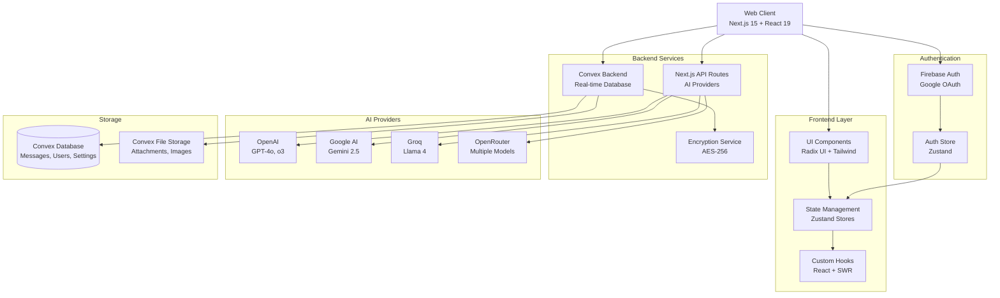
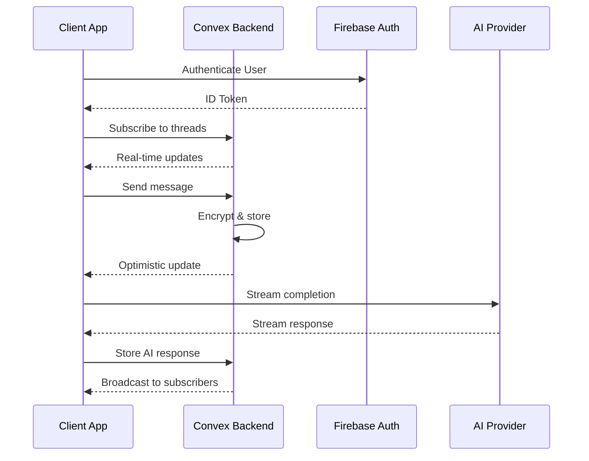
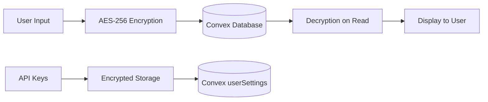

# System Overview

## Architecture Summary

Pak.Chat is a modern, high-performance chat application built on a distributed architecture that combines Next.js frontend with Convex real-time backend and Firebase authentication. The system supports multiple AI providers and implements end-to-end encryption for message security.

## High-Level Architecture Diagram



## Core Components

### 1. Frontend Architecture (`D:\Desktop\Projects\Pak.Chat\src\frontend\`)

#### State Management Layer
- **Zustand Stores**: 10 specialized stores for different concerns
- **Location**: `D:\Desktop\Projects\Pak.Chat\src\frontend\stores\`
- **Key Stores**:
  - `AuthStore.ts`: User authentication state
  - `ChatStore.ts`: Chat UI state and image generation
  - `SettingsStore.ts`: User preferences and configuration
  - `ModelStore.ts`: AI model selection and management
  - `AttachmentsStore.ts`: File upload and management

#### Component Architecture
- **Location**: `D:\Desktop\Projects\Pak.Chat\src\frontend\components\`
- **Lazy Loading**: Components split into lazy-loaded modules
- **Structure**:
  ```
  components/
  ├── ui/                    # Base UI components (Radix UI + custom)
  ├── chat-input/           # Chat input with model selection
  ├── chat-history/         # Thread management and navigation
  ├── message/              # Message rendering and controls
  ├── mobile/               # Mobile-specific optimizations
  └── lazy/                 # Lazy-loaded component wrappers
  ```

### 2. Backend Architecture (`D:\Desktop\Projects\Pak.Chat\convex\`)

#### Convex Real-time Backend
- **Schema**: `D:\Desktop\Projects\Pak.Chat\convex\schema.ts`
- **Functions**: Query and mutation functions for data operations
- **Real-time**: Automatic subscriptions for live updates

#### Key Backend Modules
```
convex/
├── schema.ts             # Database schema definition
├── messages.ts           # Message CRUD operations
├── threads.ts            # Thread management
├── users.ts              # User profile management
├── userSettings.ts       # Settings persistence
├── encryption.ts         # Message encryption/decryption
├── attachments.ts        # File storage operations
└── auth.config.js        # Firebase integration config
```

### 3. API Layer (`D:\Desktop\Projects\Pak.Chat\src\app\api\`)

#### Next.js API Routes
- **Completion**: `D:\Desktop\Projects\Pak.Chat\src\app\api\completion\route.ts`
- **LLM Integration**: `D:\Desktop\Projects\Pak.Chat\src\app\api\llm\route.ts`
- **Google LLM**: `D:\Desktop\Projects\Pak.Chat\src\app\api\llm-google\route.ts`
- **Image Generation**: `D:\Desktop\Projects\Pak.Chat\src\app\api\image-generation\route.ts`
- **File Access**: `D:\Desktop\Projects\Pak.Chat\src\app\api\files\[storageId]\route.ts`

## Technical Stack Details

### Frontend Technology Stack

| Component | Technology | Version | Purpose |
|-----------|------------|---------|---------|
| **Framework** | Next.js | 15.3.2 | App Router, SSR, API routes |
| **UI Library** | React | 19.1.0 | Component framework |
| **Language** | TypeScript | 5.8.3 | Type safety |
| **Styling** | Tailwind CSS | 4.1.8 | Utility-first CSS |
| **State Management** | Zustand | 5.0.5 | Client state management |
| **Data Fetching** | SWR | 2.3.3 | Server state caching |
| **UI Components** | Radix UI | Various | Accessible component primitives |
| **Animations** | Framer Motion | 12.18.1 | UI animations |
| **Icons** | Lucide React | 0.510.0 | Icon library |

### Backend Technology Stack

| Component | Technology | Version | Purpose |
|-----------|------------|---------|---------|
| **Database** | Convex | 1.24.8 | Real-time database |
| **Authentication** | Firebase Auth | 11.9.1 | User authentication |
| **File Storage** | Convex Storage | Built-in | File and image storage |
| **Encryption** | Crypto-JS | 4.2.0 | Message encryption |
| **AI SDK** | Vercel AI SDK | 4.3.16 | AI provider abstraction |

### AI Provider Integration

| Provider | Models Supported | SDK | Use Case |
|----------|------------------|-----|----------|
| **OpenAI** | GPT-4o, GPT-4.1 series, o3, o4-mini | @ai-sdk/openai | Text generation, image creation |
| **Google** | Gemini 2.5 Pro, Flash | @ai-sdk/google | Text generation, title generation |
| **Groq** | Llama 4 Scout/Maverick, DeepSeek R1 | @ai-sdk/groq | Fast inference |
| **OpenRouter** | DeepSeek R1, V3, various | @openrouter/ai-sdk-provider | Model variety |

## Data Flow Architecture

### 1. Real-time Synchronization



### 2. Message Encryption Flow



## Security Architecture

### Authentication Flow
- **Primary**: Firebase Google OAuth integration
- **Token Management**: JWT tokens with automatic refresh
- **State**: Managed through `AuthStore` (`D:\Desktop\Projects\Pak.Chat\src\frontend\stores\AuthStore.ts:20`)

### Data Encryption
- **Implementation**: `D:\Desktop\Projects\Pak.Chat\convex\encryption.ts`
- **Algorithm**: AES-256-GCM encryption
- **Scope**: All message content and user API keys
- **Key Management**: Server-side encryption with secure key derivation

### Access Control
- **User Isolation**: All data scoped to authenticated user ID
- **Thread Ownership**: Verified on every database operation
- **API Key Security**: Encrypted storage with user-specific encryption

## Performance Optimizations

### Frontend Optimizations
1. **Code Splitting**: Lazy-loaded components in `D:\Desktop\Projects\Pak.Chat\src\frontend\components\lazy\`
2. **Image Optimization**: WebP conversion and progressive loading
3. **State Management**: Optimized selectors with `useOptimizedSelectors`
4. **Caching**: SWR for server state with intelligent cache invalidation

### Backend Optimizations
1. **Real-time Updates**: Convex subscriptions for live data
2. **Query Optimization**: Indexed queries and efficient data fetching
3. **File Storage**: Convex native file storage with preview generation
4. **Connection Pooling**: Efficient database connection management

### Mobile Optimizations
1. **PWA Support**: Service worker and offline capabilities
2. **Touch Gestures**: Optimized mobile interactions
3. **Keyboard Handling**: Intelligent keyboard inset management
4. **Performance**: Mobile-specific component optimizations

## Deployment Architecture

### Production Environment
- **Frontend**: Vercel deployment with Edge functions
- **Backend**: Convex cloud infrastructure
- **CDN**: Automatic global distribution
- **SSL**: Automatic HTTPS with certificate management

### Development Environment
- **Local Development**: Next.js dev server with Turbopack
- **Backend**: Convex dev environment with live reload
- **Hot Reloading**: Full-stack development with instant updates

## Monitoring and Observability

### Error Tracking
- **Frontend**: Error boundaries and client-side error handling
- **Backend**: Convex built-in error logging and monitoring
- **Performance**: Next.js analytics and Core Web Vitals

### Logging
- **Application Logs**: Structured logging for debugging
- **User Actions**: Event tracking for analytics
- **Performance Metrics**: Real-time performance monitoring

## Scalability Considerations

### Horizontal Scaling
- **Stateless Frontend**: Can be deployed across multiple regions
- **Backend Scaling**: Convex handles automatic scaling
- **CDN Distribution**: Global content delivery for optimal performance

### Data Management
- **Real-time Sync**: Efficient conflict resolution
- **Storage Optimization**: Intelligent file compression and caching
- **Query Performance**: Optimized database indexes and query patterns

---

*This document reflects the current system architecture as implemented in the Pak.Chat codebase at D:\Desktop\Projects\Pak.Chat*