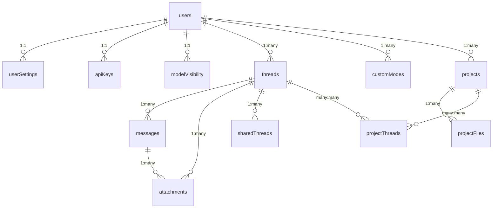

# Database Schema Documentation

## Overview

Pak.Chat uses **Convex** (version 1.24.8) as its database solution, providing real-time synchronization, type-safe queries, and serverless scaling. The database schema is defined in TypeScript using Convex's schema definition system, ensuring type safety across the entire application stack.

## Core Architecture

### Database Technology Stack
- **Database**: Convex Serverless Database
- **Schema Definition**: TypeScript with Convex schema builders
- **Query Language**: Convex Query API with TypeScript
- **Real-time**: Built-in real-time subscriptions
- **Authentication**: Firebase Auth integration
- **Encryption**: AES-GCM encryption for sensitive data

### Schema Location
Primary schema definition: `/convex/schema.ts:5-162`

## Complete Schema Definition

### 1. Users Table

**Purpose**: Stores user authentication and profile information synchronized with Firebase Auth.

```typescript
// /convex/schema.ts:7-12
users: defineTable({
  name: v.string(),
  email: v.optional(v.string()),
  avatarUrl: v.optional(v.string()),
  tokenIdentifier: v.string(),
}).index("by_token", ["tokenIdentifier"])
```

**Field Specifications**:
- `name` (string, required): User's display name from Firebase Auth
- `email` (string, optional): User's email address from Firebase Auth
- `avatarUrl` (string, optional): URL to user's profile picture
- `tokenIdentifier` (string, required): Firebase Auth UID for authentication

**Indexes**:
- `by_token` on `["tokenIdentifier"]`: Primary lookup for user authentication
- Convex auto-generates `_id` and `_creationTime` fields

**Security Constraints**:
- User records are synchronized from Firebase Auth only
- No direct user creation through client API
- Access controlled via Firebase token validation

### 2. User Settings Table

**Purpose**: Stores comprehensive user preferences, encrypted API keys, and UI customization settings.

```typescript
// /convex/schema.ts:15-43
userSettings: defineTable({
  userId: v.id("users"),
  encryptedApiKeys: v.string(),
  uiFont: v.optional(v.string()),
  codeFont: v.optional(v.string()),
  hidePersonal: v.optional(v.boolean()),
  showNavBars: v.optional(v.boolean()),
  showChatPreview: v.optional(v.boolean()),
  // Feature toggles
  isCustomModesEnabled: v.optional(v.boolean()),
  selectedMode: v.optional(v.string()),
  webSearchEnabled: v.optional(v.boolean()),
  selectedModel: v.optional(v.string()),
  // DEPRECATED: saveRegenerationHistory
  saveRegenerationHistory: v.optional(v.boolean()),
  // Custom instructions for AI behavior
  customInstructionsName: v.optional(v.string()),
  customInstructionsOccupation: v.optional(v.string()),
  customInstructionsTraits: v.optional(v.array(v.string())),
  customInstructionsTraitsText: v.optional(v.string()),
  customInstructionsAdditionalInfo: v.optional(v.string()),
  // Image generation settings
  imageGenerationModel: v.optional(v.string()),
  imageGenerationSize: v.optional(v.string()),
  imageGenerationQuality: v.optional(v.string()),
  imageGenerationCount: v.optional(v.number()),
  imageGenerationFormat: v.optional(v.string()),
  imageGenerationCompression: v.optional(v.number()),
}).index("by_user", ["userId"])
```

**Field Categories**:

#### Security & Authentication
- `userId` (id<users>, required): Foreign key to users table
- `encryptedApiKeys` (string, required): Encrypted JSON blob of API keys

#### UI Preferences
- `uiFont` (string, optional): User interface font preference
- `codeFont` (string, optional): Code block font preference
- `hidePersonal` (boolean, optional): Hide personal information in UI
- `showNavBars` (boolean, optional): Display navigation bars
- `showChatPreview` (boolean, optional): Show chat preview in sidebar

#### Feature Toggles
- `isCustomModesEnabled` (boolean, optional): Enable custom AI modes
- `selectedMode` (string, optional): Currently selected AI mode
- `webSearchEnabled` (boolean, optional): Enable web search functionality
- `selectedModel` (string, optional): Default AI model selection

#### Custom Instructions (AI Personalization)
- `customInstructionsName` (string, optional): User's name for AI context
- `customInstructionsOccupation` (string, optional): User's occupation
- `customInstructionsTraits` (array<string>, optional): Pre-defined personality traits
- `customInstructionsTraitsText` (string, optional): Free-form personality description
- `customInstructionsAdditionalInfo` (string, optional): Additional context for AI

#### Image Generation Settings
- `imageGenerationModel` (string, optional): Model for image generation ('gpt-image-1')
- `imageGenerationSize` (string, optional): Image dimensions ('auto', '1024x1024', '1024x1536', '1536x1024')
- `imageGenerationQuality` (string, optional): Image quality ('auto', 'low', 'medium', 'high')
- `imageGenerationCount` (number, optional): Number of images to generate (1-4)
- `imageGenerationFormat` (string, optional): Output format ('png', 'jpeg', 'webp')
- `imageGenerationCompression` (number, optional): Compression level (0-100)

**Indexes**:
- `by_user` on `["userId"]`: One-to-one relationship with users

**Encryption Implementation**:
- API keys stored as encrypted JSON in `encryptedApiKeys` field
- Uses AES-GCM encryption with PBKDF2 key derivation
- Encryption secret configurable via `ENCRYPTION_SECRET` environment variable

### 3. API Keys Table

**Purpose**: Secure storage for external API keys with individual encryption per provider.

```typescript
// /convex/schema.ts:46-53
apiKeys: defineTable({
  userId: v.id("users"),
  google: v.optional(v.string()),
  openrouter: v.optional(v.string()),
  openai: v.optional(v.string()),
  groq: v.optional(v.string()),
  encryptedAt: v.number(),
}).index("by_user", ["userId"])
```

**Field Specifications**:
- `userId` (id<users>, required): Foreign key to users table
- `google` (string, optional): Encrypted Google AI API key
- `openrouter` (string, optional): Encrypted OpenRouter API key
- `openai` (string, optional): Encrypted OpenAI API key
- `groq` (string, optional): Encrypted Groq API key
- `encryptedAt` (number, required): Timestamp of last encryption

**Security Features**:
- Each API key encrypted individually using AES-GCM
- Encryption timestamp for key rotation validation
- Access restricted to owning user only

### 4. Model Visibility Table

**Purpose**: Manages user preferences for AI model visibility and selection.

```typescript
// /convex/schema.ts:56-61
modelVisibility: defineTable({
  userId: v.id("users"),
  favoriteModels: v.array(v.string()),
  enabledProviders: v.array(v.string()),
  selectedModel: v.optional(v.string()),
}).index("by_user", ["userId"])
```

**Field Specifications**:
- `userId` (id<users>, required): Foreign key to users table
- `favoriteModels` (array<string>, required): List of user's favorite AI models
- `enabledProviders` (array<string>, required): Active AI providers for user
- `selectedModel` (string, optional): Currently selected AI model

### 5. Threads Table

**Purpose**: Core chat thread management with support for system threads, cloning, and drafts.

```typescript
// /convex/schema.ts:64-76
threads: defineTable({
  userId: v.id("users"),
  title: v.string(),
  system: v.optional(v.boolean()),
  createdAt: v.number(),
  pinned: v.optional(v.boolean()),
  clonedFrom: v.optional(v.id("threads")),
  forkedFromMessageId: v.optional(v.id("messages")),
  draft: v.optional(v.string()),
})
  .index("by_user_and_time", ["userId", "createdAt"])
  .searchIndex("by_title", { searchField: "title" })
```

**Field Specifications**:
- `userId` (id<users>, required): Thread owner
- `title` (string, required): Thread display name
- `system` (boolean, optional): System-generated thread flag
- `createdAt` (number, required): Timestamp of thread creation
- `pinned` (boolean, optional): User pinned status
- `clonedFrom` (id<threads>, optional): Source thread for clones
- `forkedFromMessageId` (id<messages>, optional): Message where thread was forked
- `draft` (string, optional): Unsent message draft for thread

**Indexes**:
- `by_user_and_time` on `["userId", "createdAt"]`: Chronological listing for users
- `by_title` search index: Full-text search on thread titles

**Business Logic**:
- Thread cloning preserves message history and metadata
- Draft auto-save functionality for unsent messages
- System threads for onboarding and help content

### 6. Messages Table

**Purpose**: Stores chat messages with encryption, model tracking, and metadata support.

```typescript
// /convex/schema.ts:79-88
messages: defineTable({
  threadId: v.id("threads"),
  authorId: v.id("users"),
  role: v.union(v.literal("user"), v.literal("assistant")),
  content: v.string(),
  createdAt: v.number(),
  model: v.optional(v.string()),
  metadata: v.optional(v.any()),
}).index("by_thread_and_time", ["threadId", "createdAt"])
```

**Field Specifications**:
- `threadId` (id<threads>, required): Parent thread reference
- `authorId` (id<users>, required): Message author
- `role` ("user" | "assistant", required): Message sender type
- `content` (string, required): Encrypted message content
- `createdAt` (number, required): Message timestamp
- `model` (string, optional): AI model used for assistant messages
- `metadata` (any, optional): Additional message data (image generation, etc.)

**Indexes**:
- `by_thread_and_time` on `["threadId", "createdAt"]`: Chronological message ordering

**Encryption Details**:
- All message content encrypted using AES-GCM
- Decryption handled automatically in queries
- Failed decryption falls back to original content

**Metadata Usage**:
- Image generation parameters and results
- Tool usage information
- Custom message flags and annotations

### 7. Attachments Table

**Purpose**: File attachment management with preview support, caching, and storage integration.

```typescript
// /convex/schema.ts:91-109
attachments: defineTable({
  threadId: v.id("threads"),
  fileId: v.string(),
  name: v.string(),
  type: v.string(),
  messageId: v.optional(v.id("messages")),
  width: v.optional(v.number()),
  height: v.optional(v.number()),
  previewId: v.optional(v.string()),
  size: v.optional(v.number()),
  cachedUrl: v.optional(v.string()),
  cachedPreviewUrl: v.optional(v.string()),
  urlExpiresAt: v.optional(v.number()),
})
  .index("by_thread", ["threadId"])
  .index("by_message", ["messageId"])
```

**Field Specifications**:
- `threadId` (id<threads>, required): Thread association
- `fileId` (string, required): Convex storage file ID
- `name` (string, required): Original filename
- `type` (string, required): MIME type
- `messageId` (id<messages>, optional): Associated message
- `width`/`height` (number, optional): Image dimensions
- `previewId` (string, optional): Convex storage ID for preview image
- `size` (number, optional): File size in bytes
- `cachedUrl`/`cachedPreviewUrl` (string, optional): Cached signed URLs
- `urlExpiresAt` (number, optional): URL expiration timestamp

**Indexes**:
- `by_thread` on `["threadId"]`: All thread attachments
- `by_message` on `["messageId"]`: Message-specific attachments

**Storage Architecture**:
- Files stored in Convex Storage with unique IDs
- Automatic preview generation for images
- URL caching with 2-hour TTL for performance
- Lazy loading based on file size thresholds

### 8. Shared Threads Table

**Purpose**: Public sharing of chat threads with anonymous options.

```typescript
// /convex/schema.ts:112-124
sharedThreads: defineTable({
  shareId: v.string(),
  originalThreadId: v.id("threads"),
  userId: v.id("users"),
  title: v.string(),
  isAnonymous: v.optional(v.boolean()),
  messages: v.array(
    v.object({
      role: v.union(v.literal("user"), v.literal("assistant")),
      content: v.string(),
    }),
  ),
}).index("by_share_id", ["shareId"])
```

**Field Specifications**:
- `shareId` (string, required): Public share identifier (8-character UUID)
- `originalThreadId` (id<threads>, required): Source thread reference
- `userId` (id<users>, required): Thread owner
- `title` (string, required): Shared thread title
- `isAnonymous` (boolean, optional): Hide user information in shared view
- `messages` (array<object>, required): Decrypted message snapshot

**Indexes**:
- `by_share_id` on `["shareId"]`: Public access lookup

**Privacy Features**:
- Messages decrypted and stored as snapshot
- Anonymous sharing hides user profile information
- No real-time updates for shared threads

### 9. Custom Modes Table

**Purpose**: User-defined AI behavior modes with custom system prompts.

```typescript
// /convex/schema.ts:127-134
customModes: defineTable({
  userId: v.id("users"),
  name: v.string(),
  systemPrompt: v.string(),
  icon: v.string(),
  createdAt: v.number(),
  updatedAt: v.number(),
}).index("by_user", ["userId"])
```

**Field Specifications**:
- `userId` (id<users>, required): Mode owner
- `name` (string, required): Mode display name
- `systemPrompt` (string, required): Custom system prompt for AI
- `icon` (string, required): Mode icon identifier
- `createdAt` (number, required): Creation timestamp
- `updatedAt` (number, required): Last modification timestamp

### 10. Projects Table

**Purpose**: Project organization for files and chat threads.

```typescript
// /convex/schema.ts:137-142
projects: defineTable({
  userId: v.id("users"),
  name: v.string(),
  customInstructions: v.optional(v.string()),
  isPublic: v.boolean(),
}).index("by_user", ["userId"])
```

**Field Specifications**:
- `userId` (id<users>, required): Project owner
- `name` (string, required): Project name
- `customInstructions` (string, optional): Project-specific AI instructions
- `isPublic` (boolean, required): Public visibility flag

### 11. Project Files Table

**Purpose**: File storage within projects for context and knowledge management.

```typescript
// /convex/schema.ts:145-151
projectFiles: defineTable({
  userId: v.id("users"),
  projectId: v.id("projects"),
  name: v.string(),
  content: v.string(),
  fileType: v.string(),
}).index("by_project", ["projectId"])
```

**Field Specifications**:
- `userId` (id<users>, required): File owner
- `projectId` (id<projects>, required): Parent project
- `name` (string, required): Filename
- `content` (string, required): File content (text-based)
- `fileType` (string, required): File type identifier

### 12. Project Threads Table

**Purpose**: Many-to-many relationship between projects and chat threads.

```typescript
// /convex/schema.ts:154-160
projectThreads: defineTable({
  userId: v.id("users"),
  projectId: v.id("projects"),
  threadId: v.id("threads"),
})
  .index("by_project", ["projectId"])
  .index("by_thread", ["threadId"])
```

**Field Specifications**:
- `userId` (id<users>, required): Relationship owner
- `projectId` (id<projects>, required): Project reference
- `threadId` (id<threads>, required): Thread reference

**Indexes**:
- `by_project` on `["projectId"]`: All threads in project
- `by_thread` on `["threadId"]`: Project association for thread

## Data Relationships

### Primary Relationships



### Foreign Key Constraints

All foreign key relationships are enforced through Convex's type system:

- **User Ownership**: All tables except `sharedThreads` enforce user ownership
- **Thread Association**: Messages and attachments must belong to valid threads
- **Project Relationships**: Project files and thread associations require valid projects
- **Message Association**: Attachments can optionally link to specific messages

### Cascade Behaviors

Implemented in application logic:

- **User Deletion**: Cascade to all user-owned records
- **Thread Deletion**: Cascade to messages and attachments (`/convex/threads.ts:250-265`)
- **Project Deletion**: Cascade to project files and thread associations (`/convex/projects.ts:105-124`)
- **Message Deletion**: Optional cascade to attachments (`/convex/attachments.ts:272-296`)

## Performance Optimizations

### Index Strategy

1. **User-based Indexes**: All tables have `by_user` indexes for user data isolation
2. **Time-based Indexes**: Threads and messages indexed by creation time for chronological queries
3. **Relationship Indexes**: Foreign key fields indexed for efficient joins
4. **Search Indexes**: Full-text search on thread titles

### Query Patterns

1. **Batch Loading**: Messages load with attachments in single query (`/convex/messages.ts:31-82`)
2. **Pagination**: Built-in Convex pagination for large datasets
3. **Parallel Queries**: Multiple independent queries executed concurrently
4. **Caching**: URL caching for attachments with TTL

### Data Denormalization

- **Shared Threads**: Messages denormalized for public access performance
- **Cached URLs**: Pre-computed signed URLs stored with expiration
- **User Names**: Cached in shared threads for anonymous/identified display

## Security Implementation

### Encryption Architecture

**File**: `/convex/encryption.ts:1-160`

#### Algorithm Specifications
- **Cipher**: AES-GCM (256-bit keys)
- **Key Derivation**: PBKDF2 with SHA-256
- **IV Length**: 12 bytes (GCM standard)
- **Iterations**: 100,000 (PBKDF2)
- **Salt**: Static "pak-chat-salt" for deterministic keys

#### Implementation Details
```typescript
// /convex/encryption.ts:33-34
const SECRET = process.env.ENCRYPTION_SECRET || 'pak-chat-default-secret-key-2024';
```

#### Encrypted Fields
- `messages.content`: All chat message content
- `userSettings.encryptedApiKeys`: Legacy encrypted API keys
- `apiKeys.google|openrouter|openai|groq`: Individual provider keys

#### Graceful Degradation
- Invalid base64 data returned as plaintext
- Decryption failures log warnings and return original data
- Backward compatibility with unencrypted legacy data

### Access Control

#### Authentication Flow
1. Firebase Auth token validation
2. User lookup by `tokenIdentifier`
3. Resource ownership verification
4. Query/mutation execution

#### Authorization Patterns
```typescript
// /convex/utils.ts:9-24
export async function currentUserId(ctx: QueryCtx | MutationCtx): Promise<Id<"users"> | null> {
  const identity = await ctx.auth.getUserIdentity();
  if (!identity) return null;
  
  const user = await ctx.db
    .query("users")
    .withIndex("by_token", (q) => q.eq("tokenIdentifier", identity.subject))
    .unique();
    
  return user?._id || null;
}
```

#### Resource Protection
- All queries verify user ownership before data access
- Mutations validate user permissions on target resources
- Cross-user data access only for public shares

## Schema Versioning Strategy

### Current Version
- Schema version: Implicit (no versioning system implemented)
- Convex handles schema changes through development/production sync

### Migration Approach
- **Field Addition**: Optional fields added safely
- **Field Removal**: Deprecated fields left in schema with comments
- **Type Changes**: New fields created, old fields deprecated
- **Index Changes**: New indexes added, old indexes removed after deployment

### Backward Compatibility
- Optional fields maintain compatibility
- Encryption system handles legacy unencrypted data
- API endpoints gracefully handle missing fields

### Example Deprecation
```typescript
// /convex/schema.ts:28-29
// DEPRECATED: saveRegenerationHistory - no longer used
saveRegenerationHistory: v.optional(v.boolean()),
```

## Performance Monitoring

### Query Performance
- Convex built-in query performance metrics
- Index usage optimization through Convex dashboard
- Real-time query profiling in development

### Storage Efficiency
- Attachment size tracking for optimization decisions
- File compression for supported formats
- Preview generation for reduced bandwidth

### Scalability Considerations
- User data isolation through indexes
- Horizontal scaling via Convex serverless architecture
- Connection pooling handled by Convex infrastructure

This comprehensive schema documentation provides a complete technical reference for the Pak.Chat database implementation, covering all tables, relationships, security measures, and performance optimizations as implemented in the actual codebase.